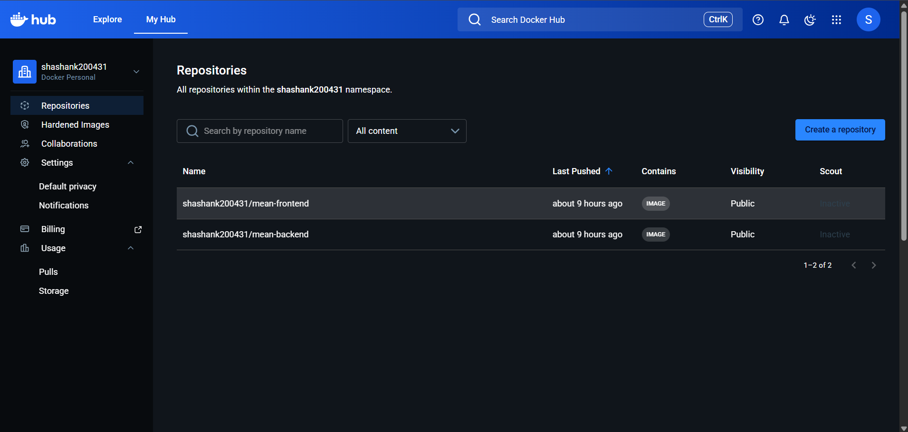
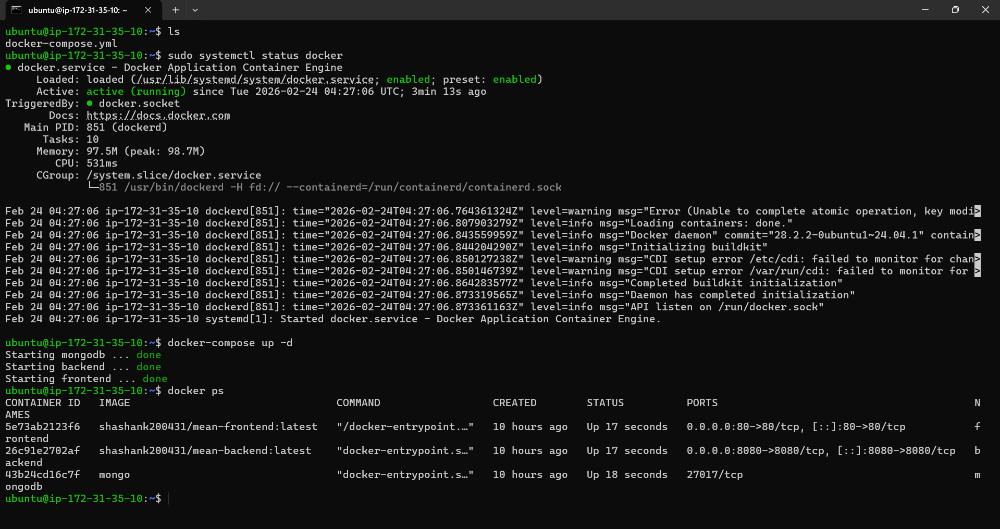
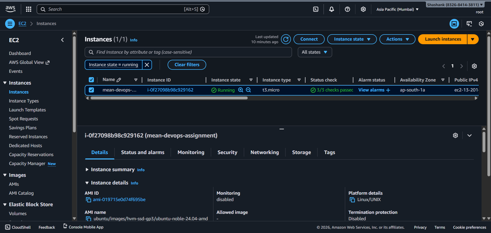
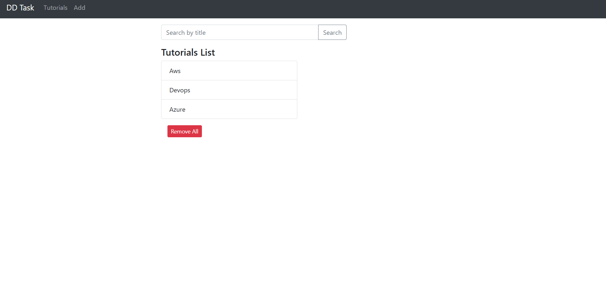
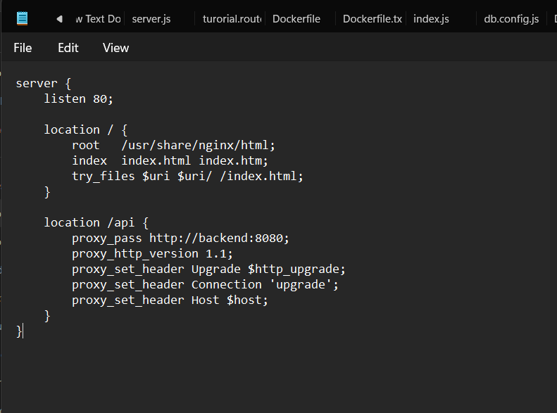

# MEAN DevOps Assignment

## 📌 Project Overview

This project demonstrates containerization and CI/CD implementation for a MEAN stack (MongoDB, Express, Angular, Node.js) application.

The solution includes:

- Angular frontend
- Node.js + Express backend
- MongoDB database
- Nginx reverse proxy
- Docker & Docker Compose
- CI pipeline using GitHub Actions
- Docker Hub image automation
- Deployment on AWS EC2

---

## 🏗 Architecture

Client → Nginx → Angular → Node.js API → MongoDB

- The frontend is served using Nginx.
- API requests (`/api`) are proxied to the backend container.
- Backend communicates with MongoDB container.
- All services are managed using Docker Compose.

---

## 🐳 Docker Configuration

### Backend
- Dockerized using Node 18 base image
- Runs on port 8080
- Connects to MongoDB service

### Frontend
- Multi-stage Docker build
- Angular build using Node
- Production served via Nginx
- Reverse proxy configured for `/api`

### MongoDB
- Official Mongo image
- Persistent volume configured

---

## 🐙 Docker Compose

To run locally:

```bash
docker-compose up --build
```

Access application locally:

```
http://localhost
```

---

## ☁ AWS Deployment

The application is deployed on:

- AWS EC2 (Ubuntu)
- Docker & Docker Compose installed
- Containers managed using docker-compose
- Security Group allows HTTP (Port 80)

Live URL:

```
http://13.201.90.195
```

(Note: EC2 instance may need to be started if stopped.)

---

## 🔁 CI/CD Pipeline (GitHub Actions)

On every push to the `main` branch:

1. Checkout repository
2. Login to Docker Hub using GitHub Secrets
3. Build backend Docker image
4. Build frontend Docker image
5. Push both images to Docker Hub

Workflow file location:

```
.github/workflows/docker-ci.yml
```

---

## 🐳 Docker Hub Images

Docker Hub Profile:

https://hub.docker.com/u/shashank200431

Images:
- mean-backend
- mean-frontend

---

## 📸 Screenshots

### CI/CD Pipeline Execution


### Docker Hub Images


### Running Containers on EC2


### EC2 Instance Running


### Application Working UI


### Nginx Configuration


---

## 🔧 Tech Stack

- Angular
- Node.js
- Express
- MongoDB
- Docker
- Docker Compose
- Nginx
- GitHub Actions
- AWS EC2

---

## 📌 How to Restart on EC2

If the EC2 instance is stopped:

1. Start the instance from AWS Console
2. SSH into EC2
3. Run:

```bash
docker-compose up -d
```

---

## ✅ Assignment Requirements Covered

- Dockerfiles for frontend & backend
- Docker Compose setup
- MongoDB container integration
- Nginx reverse proxy configuration
- CI/CD pipeline using GitHub Actions
- Docker Hub image automation
- AWS EC2 deployment
- Complete documentation with screenshots
